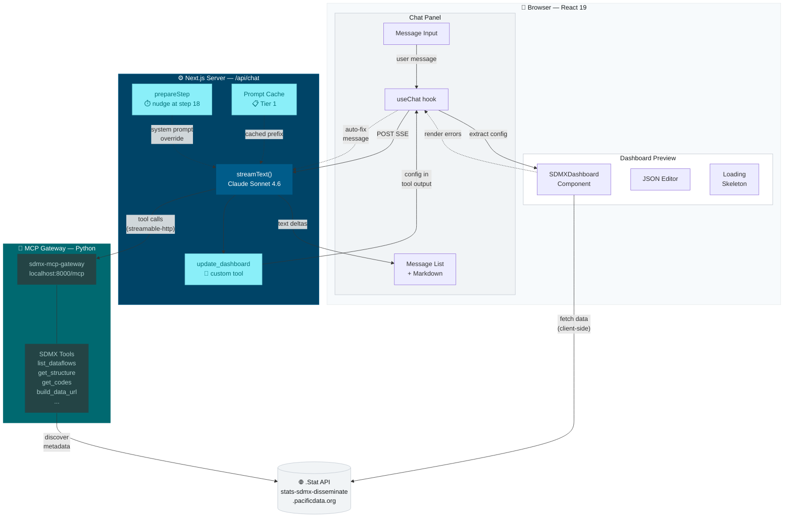

# SPC Conversational Dashboard Builder

A web app where users describe dashboards in natural language and an AI agent produces live SDMX data visualizations for Pacific Island Countries and Territories.

Built on three existing components:
- **sdmx-mcp-gateway** — Python MCP server for progressive SDMX data discovery
- **sdmx-dashboard-components** — React library rendering dashboards from JSON configs via Highcharts
- **AI SDK v6** — connects a chat interface to Claude, which orchestrates discovery and produces dashboard configs

## Prerequisites

| Tool | Version | Purpose |
|------|---------|---------|
| Node.js | >= 22 | Next.js runtime |
| npm | >= 11 | Package management |
| Python | >= 3.12 | MCP gateway runtime |
| uv | latest | Python package manager (for the gateway) |
| Git | any | Cloning repositories |

You also need an **Anthropic API key** with access to Claude Sonnet 4.6.

## Repository Layout

```
dashboarder/
├── app/
│   ├── layout.tsx                  # Root layout (fonts, CSS imports)
│   ├── globals.css                 # Tailwind v4 + Oceanic design tokens
│   ├── page.tsx                    # Redirect to /builder
│   ├── builder/
│   │   └── page.tsx                # Main split-pane view (chat + preview)
│   └── api/
│       └── chat/
│           └── route.ts            # Agent loop: streamText + MCP + tools
├── components/
│   ├── chat-panel.tsx              # Chat UI (message list, input, suggestions)
│   ├── message-bubble.tsx          # Chat message rendering with markdown
│   └── dashboard-preview.tsx       # SDMXDashboard wrapper, JSON editor, skeleton
├── lib/
│   ├── system-prompt.ts            # AI system prompt (schema, workflow, strategy)
│   ├── dashboard-examples.ts       # Example configs for few-shot prompting
│   └── types.ts                    # Dashboard config TypeScript types
├── patches/
│   └── sdmx-dashboard-components+0.4.5.patch  # Null-guard for dimension lookup
├── stitch_assets/                  # UI mockups and design system spec
│   └── stitch/oceanic_logic/DESIGN.md          # Oceanic Data-Scapes design system
├── CLAUDE.md                       # Instructions for Claude Code
├── .env.local                      # API keys (not committed)
├── next.config.ts
├── tsconfig.json
├── postcss.config.mjs
└── package.json
```

## Setup

### 1. Clone the MCP gateway

The AI agent needs the SDMX MCP gateway running locally. Clone it next to this repo:

```bash
cd /path/to/your/repos
git clone https://github.com/Baffelan/sdmx-mcp-gateway.git
cd sdmx-mcp-gateway
```

Install Python dependencies with uv:

```bash
uv sync
```

### 2. Start the MCP gateway

```bash
cd /path/to/sdmx-mcp-gateway
uv run python main_server.py --transport streamable-http --host 0.0.0.0 --port 8000
```

You should see output confirming the server is running on `http://0.0.0.0:8000`. The MCP endpoint is at `/mcp`.

### 3. Install the dashboard builder

```bash
cd /path/to/dashboarder
npm install
```

The `postinstall` script automatically applies `patches/sdmx-dashboard-components+0.4.5.patch`, which adds a null-guard for a dimension lookup bug in the library.

### 4. Configure environment

Create `.env.local` in the project root (or edit the existing one):

```bash
ANTHROPIC_API_KEY=sk-ant-...your-key-here...
MCP_GATEWAY_URL=http://localhost:8000/mcp
```

### 5. Start the dev server

```bash
npm run dev
```

Open [http://localhost:3000/builder](http://localhost:3000/builder).

## Usage

### Basic flow

1. Type a request in the chat panel, e.g. "Show me population data for Pacific Islands"
2. The AI discovers available data via MCP tools (you'll see tool status indicators)
3. A dashboard config is produced and rendered live in the preview pane
4. Ask follow-up questions to refine: "Change it to a line chart", "Add Fiji and Tonga", etc.

### Complex dashboards

For broad requests like "comprehensive health dashboard", the AI will:
1. Survey available dataflows
2. Propose a multi-panel structure and ask for confirmation
3. Build panel by panel, showing progress after each one
4. Offer next steps after each update

### JSON editor

Click the **JSON** tab in the preview pane to inspect or manually edit the dashboard config. Changes can be applied back to the live preview with the **Apply** button.

## Architecture



### Data flow

1. User types a message → `useChat` POSTs to `/api/chat` via SSE
2. `streamText` calls Claude with MCP tools + the custom `update_dashboard` tool
3. Claude does progressive discovery via MCP (list dataflows → get structure → build URL)
4. Claude calls `update_dashboard` with the dashboard JSON config
5. The tool output flows back to the client via the SSE stream
6. The client extracts the config from the tool output in the message parts
7. `SDMXDashboard` renders the config, fetching live data directly from .Stat
8. If rendering fails, the error is automatically sent back to the AI to fix

## Key Technical Decisions

### AI SDK v6 API

- `useChat` from `@ai-sdk/react` with `DefaultChatTransport`
- Server returns `result.toUIMessageStreamResponse()` (SSE)
- Dashboard config delivered via `update_dashboard` tool output (not data stream annotations)
- `prepareStep` injects a "nudge" system message at step 18 if no dashboard has been emitted
- Prompt caching via `providerOptions.anthropic.cacheControl`

### Dashboard config schema

The `update_dashboard` tool accepts a JSON config matching `sdmx-dashboard-components` v0.4.5. Key quirk: the library's TypeScript types say `colums` (typo) but the **runtime JavaScript uses `columns`** (correct spelling). We use `columns` everywhere.

### Library patches

`sdmx-dashboard-components` has a bug where bar/column charts crash if `getActiveDimensions()` doesn't find the expected dimensions. The patch in `patches/` adds a null-guard that logs a warning instead of crashing.

### Error handling

- **Highcharts errors** (e.g. #14 "string data") are intercepted via a global `displayError` event handler that calls `preventDefault()` to avoid throwing
- **Fetch errors** from `sdmx-json-parser` (e.g. "observations empty") are caught via `unhandledrejection` listener
- Errors are debounced, deduplicated, and automatically sent back to the AI as a system message so it can fix the config

## Design System

The UI implements the "Oceanic Data-Scapes" design system from `stitch_assets/stitch/oceanic_logic/DESIGN.md`:

- **No 1px borders** — regions separated via tonal surface shifts
- **Surface hierarchy:** base `#f7fafc` -> low `#f1f4f6` -> card `#ffffff` -> high `#e5e9eb`
- **Primary palette:** Deep Sea `#004467`, Reef Teal `#006970`, Lagoon `#6fd6df`
- **Typography:** Manrope (headlines) + Inter (interface/data)
- **Glassmorphism:** 85% opacity + 20px backdrop-blur for the app bar
- **Ambient shadows:** `0 12px 40px rgba(24,28,30,0.06)` instead of hard borders
- **Ocean gradient:** 135deg `#004467` -> `#005c8a` for primary CTAs

## Development

```bash
npm run dev       # Start dev server (Turbopack)
npm run build     # Production build (Webpack)
npm run lint      # ESLint
```

### Adding new MCP tools

The agent loop in `app/api/chat/route.ts` automatically picks up all tools from the MCP gateway via `mcpClient.tools()`. To add custom tools (like `update_dashboard`), define them inline in the `tools` object.

### Modifying the AI behavior

Edit `lib/system-prompt.ts`. The prompt has sections for:
- **Conversation strategy** — how the AI proposes, builds incrementally, and asks questions
- **Config schema docs** — what the dashboard JSON looks like
- **Discovery workflow** — how to use MCP tools
- **SDMX conventions** — domain knowledge about SPC .Stat
- **Tool instructions** — pacing rules and error handling

## Troubleshooting

### MCP gateway won't start

Make sure Python >= 3.12 is available and uv is installed:

```bash
python3 --version   # should be 3.12+
uv --version        # install from https://docs.astral.sh/uv/
```

### "Error while fetching data please provide valid api url"

The data URL returned no data or is malformed. Common causes:
- The MCP gateway wasn't restarted after the `dimensionAtObservation` patch
- The AI constructed a URL manually instead of using `build_data_url`
- The SDMX query filters are too restrictive (no matching data)

The error is automatically fed back to the AI, which should attempt a fix.

### "Series not found and observations empty"

The SDMX API returned a valid response but with no observations. The query matched a dataflow but no data exists for the requested dimension combination. The AI should broaden the query.

### Highcharts error #14

String values were sent to a chart expecting numbers. This is intercepted and logged as a warning — it won't crash the app.

### Dashboard shows "Loading..." forever

Check browser devtools Network tab. If the SDMX REST requests to `stats-sdmx-disseminate.pacificdata.org` are failing, it could be a CORS or network issue. The dashboard components fetch data client-side directly from the .Stat API.

### Hydration mismatch after code changes

Clear the Next.js cache and restart:

```bash
rm -rf .next && npm run dev
```

## License

See the architecture document in `dashboard-architecture.md` for project context and phased delivery plan.
