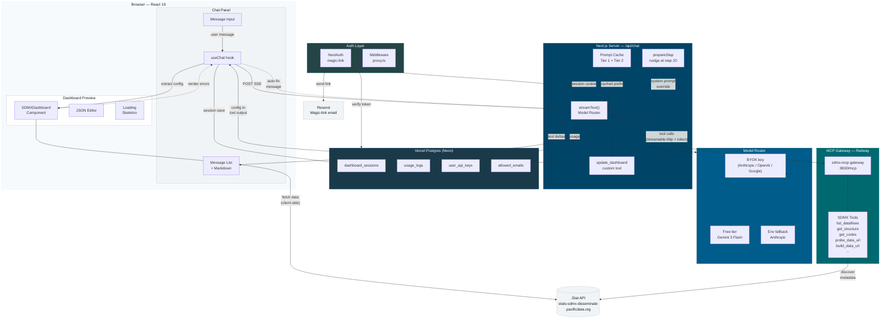

# SPC Conversational Dashboard Builder

A web app where users describe dashboards in natural language and an AI agent produces live SDMX data visualizations for Pacific Island Countries and Territories.

Built on three existing components:
- **sdmx-mcp-gateway** — Python MCP server for progressive SDMX data discovery
- **sdmx-dashboard-components** — React library rendering dashboards from JSON configs via Highcharts
- **AI SDK v6** — connects a chat interface to the AI, which orchestrates discovery and produces dashboard configs

Access is invite-only. Users sign in via email magic links. Sessions and usage are persisted in PostgreSQL.

## Prerequisites

| Tool | Version | Purpose |
|------|---------|---------|
| Node.js | >= 22 | Next.js runtime |
| npm | >= 11 | Package management |
| Python | >= 3.12 | MCP gateway runtime |
| uv | latest | Python package manager (for the gateway) |
| Git | any | Cloning repositories |

You also need:
- A **Google AI API key** (free tier via [Google AI Studio](https://aistudio.google.com/)) — primary model for pilot users without BYOK keys
- A **Resend account** with a verified sender domain for magic-link emails
- A **PostgreSQL database** — Vercel Postgres (Neon) recommended; any Postgres-compatible URL works locally
- An **Anthropic API key** (optional — development fallback if no Google key is set)

## Quick Start

```bash
# 1. Clone and start the MCP gateway
git clone https://github.com/Baffelan/sdmx-mcp-gateway.git
cd sdmx-mcp-gateway
uv sync
uv run python main_server.py --transport streamable-http --host 0.0.0.0 --port 8000

# 2. In another terminal — install and configure the dashboard builder
cd dashboarder
cp .env.example .env.local
# Edit .env.local — set at minimum:
#   DATABASE_URL, NEXTAUTH_SECRET, RESEND_API_KEY, EMAIL_FROM, GOOGLE_AI_API_KEY, ENCRYPTION_SECRET
npm install

# 3. Push the database schema
npx drizzle-kit push

# 4. Add yourself as the first admin user
npx tsx scripts/add-pilot-user.ts you@example.com --admin

# 5. Start the dev server
npm run dev

# 6. Open http://localhost:3000 — sign in via magic link, then open /builder
```

### Build the semantic search index (optional but recommended)

The `/explore` page uses a local embedding model to power semantic search. Build the index once (requires the MCP gateway running):

```bash
npm run build-index
```

This fetches all dataflows, embeds their descriptions with `granite-embedding-small-r2`, and writes `models/dataflow-index.json`. Re-run whenever the dataflow catalogue changes.

## Repository Layout

```
dashboarder/
├── app/
│   ├── layout.tsx                  # Root layout (CSS imports)
│   ├── globals.css                 # Tailwind v4 + Oceanic design tokens
│   ├── page.tsx                    # Welcome / session list (requires auth)
│   ├── login/
│   │   └── page.tsx                # Magic-link sign-in page
│   ├── builder/
│   │   └── page.tsx                # Main split-pane view (chat + preview)
│   ├── explore/
│   │   ├── page.tsx                # SDMX data catalogue with semantic search
│   │   └── [id]/page.tsx           # Dataflow detail + dimension explorer
│   ├── dashboard/
│   │   └── [id]/page.tsx           # Private presentation view for an authenticated session
│   ├── p/
│   │   └── [id]/page.tsx           # Public presentation view for a published dashboard
│   ├── gallery/
│   │   └── page.tsx                # Public gallery of published dashboards
│   ├── admin/
│   │   └── page.tsx                # Admin: invite management + user usage (admin only)
│   ├── settings/
│   │   └── page.tsx                # BYOK key management per provider
│   └── api/
│       ├── auth/[...nextauth]/     # NextAuth magic-link handler
│       ├── chat/route.ts           # Agent loop: streamText + MCP + tools
│       ├── sessions/               # Session CRUD (GET list, POST create, GET/PUT/DELETE by id, publish sub-route)
│       ├── explore/                # Dataflow catalogue + semantic search API
│       ├── admin/
│       │   ├── users/              # User list + role management (admin only)
│       │   └── invites/            # Invite allowlist CRUD (admin only)
│       └── settings/keys/          # BYOK key store/delete
├── components/
│   ├── chat-panel.tsx              # Chat UI (message list, input, suggestions)
│   ├── message-bubble.tsx          # Message rendering with markdown + tables
│   └── dashboard-preview.tsx       # Preview, JSON editor, inspector, export
├── lib/
│   ├── auth.ts                     # NextAuth config (Email provider + Resend adapter)
│   ├── model-router.ts             # Model selection: BYOK > free-tier Google > env fallback
│   ├── system-prompt.ts            # AI system prompt (strategy + schema + examples)
│   ├── dashboard-authoring.ts      # Authoring schema + compiler (intent -> native config)
│   ├── dashboard-schema.ts         # Native sdmx-dashboard-components config types
│   ├── dashboard-examples.ts       # Working example configs for few-shot prompting
│   ├── types.ts                    # Shared TypeScript types
│   ├── encryption.ts               # AES-GCM BYOK key encryption/decryption
│   ├── embeddings.ts               # Granite embedding model (semantic search)
│   ├── export-dashboard.ts         # PDF, HTML, JSON export
│   ├── session.ts                  # Session persistence helpers (DB-backed)
│   ├── use-config-history.ts       # Undo/redo hook
│   ├── tier2-knowledge.ts          # Session knowledge extraction for context
│   ├── logger.ts                   # Database-backed request logging
│   ├── mcp-client.ts               # MCP transport config (HTTP + auth token)
│   ├── csrf.ts                     # CSRF token helpers
│   └── db/
│       ├── index.ts                # Drizzle ORM client (Vercel Postgres)
│       └── schema.ts               # DB schema: auth_users, dashboard_sessions, usage_logs, user_api_keys, allowed_emails
├── scripts/
│   ├── add-pilot-user.ts           # CLI: add email to allowlist (optionally as admin)
│   └── build-index.ts              # CLI: build semantic search index from MCP gateway
├── models/
│   ├── granite-embedding-small-r2/ # Local ONNX embedding model (not committed)
│   └── dataflow-index.json         # Pre-built semantic search index (not committed)
├── tests/
│   ├── model-router.test.ts        # Vitest: model selection logic
│   └── dashboard-authoring.test.ts # Vitest: authoring schema compiler
├── patches/
│   └── sdmx-dashboard-components+0.4.5.patch
├── proxy.ts                        # NextAuth middleware (public exceptions include /login, /gallery, /p/*, /api/public/*)
├── logs/                           # Legacy local chat logs from the earlier JSONL logger (gitignored)
├── docs/
│   ├── architecture.mmd            # Mermaid source for architecture diagram
│   ├── current-architecture.md     # Implemented route/access/publication model
│   └── technical-reference.md      # Detailed technical internals
├── stitch_assets/                  # UI mockups and design system spec
├── CLAUDE.md                       # Instructions for Claude Code
├── .env.example                    # Environment template
├── .env.local                      # Secrets (gitignored)
├── drizzle.config.ts               # Drizzle ORM config
├── next.config.ts
├── tsconfig.json
├── postcss.config.mjs
└── package.json
```

## Architecture



### Data flow

1. User visits the app — `proxy.ts` middleware checks for a valid NextAuth session; unauthenticated users are redirected to `/login`
2. User requests a magic link; Resend delivers it; NextAuth verifies the token against `allowed_emails` and creates a session
3. User types a message in the chat panel
4. `useChat` POSTs to `/api/chat` with the session ID header; the route verifies the session via NextAuth
5. The model router selects a model: BYOK key first, then platform Gemini 3 Flash, then env fallback
6. `streamText` calls the model with MCP tools + `update_dashboard` custom tool
7. The model does progressive discovery via MCP (`list_dataflows` → `get_dataflow_structure` → `get_dimension_codes` → `build_data_url` → `probe_data_url` → `suggest_nonempty_queries` if empty)
8. `probe_data_url` validates a built URL before the model emits a dashboard, and `suggest_nonempty_queries` recovers empty probes without the model guessing relaxations
9. The model calls `update_dashboard` with an authoring schema config; the server compiles it to native config
10. Tool output flows back to the client via the SSE stream
11. Client extracts config from tool output in message parts
12. `SDMXDashboard` renders the config, fetching live data directly from .Stat
13. If rendering fails, the error is debounced and automatically sent back to the AI
14. Usage (tokens, steps, model) is logged to `usage_logs`; session messages/config are saved to `dashboard_sessions`

## Features

### Authentication and access control
- Email magic-link sign-in via Resend (no passwords)
- Invite-only: email must be in the `allowed_emails` allowlist before a link is sent
- All routes protected by NextAuth middleware (`proxy.ts`)
- Admin role for invite and user management

### Multi-model support
- **Free tier:** Gemini 3 Flash Preview on the platform Google AI key — no setup required for invited users
- **BYOK (Bring Your Own Key):** users can add Anthropic, OpenAI, or Google API keys in `/settings`; keys are encrypted at rest with AES-GCM
- Model picker in the builder header to switch provider/model mid-session
- Model router: BYOK takes priority, falls back to free tier, then to env-level Anthropic key

### Conversational dashboard building
- Natural language requests produce live SDMX dashboards
- AI proposes structure for complex requests, builds panel-by-panel
- Multi-turn conversation to refine charts, add panels, change data

### Dashboard authoring schema
- The AI emits simplified intent visuals (`kpi`, `chart`, `map`, `note`) rather than raw native configs
- Server-side compiler (`lib/dashboard-authoring.ts`) translates intent visuals to the native `sdmx-dashboard-components` config format
- Native passthrough (`mode: "native"`) available for advanced cases
- Zod schema validates tool input before compilation

### Probe workflow
- `probe_data_url` MCP tool validates a candidate SDMX data URL before dashboard emission
- Catches empty results, malformed keys, and missing dimensions early in the agent loop
- Reduces the feedback-loop round-trips caused by bad URLs reaching the live preview

### Live preview with JSON editor
- Real-time dashboard rendering via SDMXDashboard component
- Syntax-highlighted JSON editor with inline editing and apply/reset
- Loading skeleton matching the dashboard grid layout

### Session persistence (database-backed)
- Conversation history, dashboard config, and undo stack saved to Vercel Postgres per user
- Survives page refresh and works across devices
- Session list on the welcome page; up to 20 sessions per user
- Sessions auto-titled from the first user message

### Undo/redo
- Every dashboard update (AI or manual) pushes to a 50-entry history stack
- Undo/redo buttons in the preview header
- History persisted in the database session record

### Admin dashboard (`/admin`)
- Invite management: add/remove emails from the allowlist
- User list with role badges, session count, and token usage
- Role toggle (user/admin) per user
- Accessible only to users with `role = 'admin'`

### BYOK settings (`/settings`)
- Store one API key per provider (Anthropic, OpenAI, Google)
- Select preferred model per provider
- Keys encrypted server-side before storage; never logged

### Semantic search in `/explore`
- Data catalogue browser listing all SDMX dataflows on Pacific Data Hub
- Short queries use keyword filtering; three or more words trigger semantic search
- Semantic search powered by `ibm-granite/granite-embedding-small-english-r2` (47M params, 384 dims, ONNX quantized), running server-side on CPU — no external API call
- Country filter shows which dataflows have data for a selected Pacific territory

### Export
| Format | File | Offline | Interactive |
|--------|------|---------|-------------|
| PDF | `.pdf` | Yes | No |
| HTML (static) | `.html` | Yes | No |
| HTML (live) | `-live.html` | No | Yes |
| JSON Config | `.json` | Yes | N/A |

### Error feedback loop
- Highcharts errors intercepted (no crashes)
- Fetch failures caught via `unhandledrejection`
- Errors debounced, deduplicated, and auto-sent to AI as system messages
- AI attempts to fix the dashboard config and re-emit; max 2 auto-retries

### Tier 2 knowledge context
- Conversation history scanned for already-discovered dataflows and URLs
- Compact summary injected into the system prompt each turn
- Prevents redundant MCP discovery calls, saving tokens and steps

### Request logging
- Every chat request is written to the `usage_logs` table in Postgres (session ID, user, tokens, model, duration)
- The `logs/` directory is legacy from the earlier JSONL logger and is no longer the active logging backend

## Environment Variables

Copy `.env.example` to `.env.local` and fill in all required values:

```bash
# ── AI model providers ──────────────────────────────────────────────────────

# Google AI API key — primary free-tier model (Gemini 3 Flash)
# Get one at https://aistudio.google.com/
GOOGLE_AI_API_KEY=

# Anthropic API key — optional dev/env fallback
ANTHROPIC_API_KEY=

# ── MCP gateway ─────────────────────────────────────────────────────────────

# URL of the sdmx-mcp-gateway (streamable-http transport)
MCP_GATEWAY_URL=http://localhost:8000/mcp

# Shared auth token for the gateway — set the same value as MCP_AUTH_TOKEN on Railway
MCP_AUTH_TOKEN=

# ── Database (Vercel Postgres / Neon) ───────────────────────────────────────

# Full Postgres connection string
DATABASE_URL=

# ── NextAuth ────────────────────────────────────────────────────────────────

# Generate with: openssl rand -base64 32
NEXTAUTH_SECRET=

# Public base URL of the app
NEXTAUTH_URL=http://localhost:3000

# ── Resend (magic-link email) ───────────────────────────────────────────────

# Get one at https://resend.com/
RESEND_API_KEY=

# Verified Resend sender address
EMAIL_FROM=

# ── BYOK key encryption ─────────────────────────────────────────────────────

# 32-byte hex secret — generate with: openssl rand -hex 32
ENCRYPTION_SECRET=
```

## Development

```bash
npm run dev         # Start dev server (Turbopack)
npm run build       # Production build (Webpack)
npm run lint        # ESLint
npm run test        # Run Vitest test suite (unit tests)
npm run build-index # Build semantic search index (requires MCP gateway at localhost:8000)
```

### Tests

Tests use [Vitest](https://vitest.dev/) and live in `tests/`:

- `tests/model-router.test.ts` — model selection logic (BYOK, free tier, env fallback)
- `tests/dashboard-authoring.test.ts` — authoring schema compiler (intent visuals to native config)

### Auth middleware

`proxy.ts` at the project root is the NextAuth middleware. It protects every route except `/api/auth/*`, `/_next/*`, `/favicon.ico`, `/models/*`, and `/login`.

### Database migrations

```bash
npx drizzle-kit push     # Apply schema to the database (development)
npx drizzle-kit generate # Generate migration SQL files
npx drizzle-kit studio   # Open Drizzle Studio to browse data
```

The schema is defined in `lib/db/schema.ts` and includes:

| Table | Purpose |
|-------|---------|
| `auth_users` | Registered users with role (`user`/`admin`) |
| `auth_accounts` | NextAuth OAuth accounts (future use) |
| `auth_verification_tokens` | Magic-link tokens |
| `allowed_emails` | Invite allowlist |
| `dashboard_sessions` | Per-user sessions (messages + config history) |
| `usage_logs` | Per-request token and model usage |
| `user_api_keys` | Encrypted BYOK keys per provider |

## Deployment

### Vercel (Next.js app)

1. Connect the repository to a Vercel project
2. Add a **Vercel Postgres** database from the Vercel dashboard (Neon-backed); this auto-sets `POSTGRES_URL` and related env vars
3. Set all other environment variables in the Vercel project settings (see Environment Variables section above — use production values for `NEXTAUTH_URL`, `MCP_GATEWAY_URL`, etc.)
4. Deploy; the build runs `next build`
5. After first deploy, push the schema and create the first admin user locally:

```bash
# Point at the production DB (use the Vercel Postgres connection string)
DATABASE_URL=<prod-connection-string> npx drizzle-kit push
npx tsx scripts/add-pilot-user.ts admin@example.com --admin
```

### Railway (MCP gateway)

1. Create a new Railway project and add a service from the `sdmx-mcp-gateway` GitHub repo
2. Set the start command:
   ```
   uv run python main_server.py --transport streamable-http --host 0.0.0.0 --port 8000
   ```
3. Set the `MCP_AUTH_TOKEN` environment variable in Railway (any strong random string)
4. Note the Railway service's public URL; set `MCP_GATEWAY_URL=https://<railway-url>/mcp` in Vercel
5. Set the same `MCP_AUTH_TOKEN` value in Vercel so the Next.js app can authenticate to the gateway

## Design System

The UI implements the **Oceanic Data-Scapes** design system (`stitch_assets/stitch/oceanic_logic/DESIGN.md`):

- **No 1px borders** — regions separated via tonal surface shifts
- **Surface hierarchy:** base `#f7fafc` -> low `#f1f4f6` -> card `#ffffff` -> high `#e5e9eb`
- **Primary palette:** Deep Sea `#004467`, Reef Teal `#006970`, Lagoon `#6fd6df`
- **Typography:** Manrope (headlines) + Inter (interface/data)
- **Glassmorphism:** 85% opacity + 20px backdrop-blur for app bar
- **Ambient shadows:** `0 12px 40px rgba(24,28,30,0.06)`
- **Ocean gradient:** 135deg `#004467` -> `#005c8a` for primary CTAs

## Troubleshooting

### "Unauthorized" on the chat API
The session cookie is missing or expired. Sign out and sign in again via the magic-link flow at `/login`.

### MCP gateway won't start
Ensure Python >= 3.12 and `uv` are installed. Run `uv sync` before starting.

### Magic links not arriving
Check that `RESEND_API_KEY` is set and `EMAIL_FROM` is a verified Resend sender. In development, Resend delivers to real addresses — there is no local preview mode.

### "Error while fetching data please provide valid api url"
The data URL is malformed or returned no data. The error is auto-sent to the AI for fixing. Check that `probe_data_url` is being used before `update_dashboard` — the system prompt instructs the agent to probe first.

### Semantic search returns no results
The index has not been built. Run `npm run build-index` with the MCP gateway running. Check that `models/granite-embedding-small-r2/` exists (ONNX model files must be downloaded separately — see `lib/embeddings.ts` for the model ID).

### Dashboard shows "Loading..." forever
Check the browser Network tab — SDMX REST requests to `stats-sdmx-disseminate.pacificdata.org` may be failing (CORS or network).

### Hydration mismatch after code changes
```bash
rm -rf .next && npm run dev
```

### Database connection errors
Ensure `DATABASE_URL` is set and the Postgres instance is reachable. For Vercel Postgres locally, use the "Direct connection" string (not the pooled one) for `drizzle-kit push`.

## Technical Reference

See [`docs/current-architecture.md`](docs/current-architecture.md) for the implemented route/access/publication model, and [`docs/technical-reference.md`](docs/technical-reference.md) for lower-level technical internals and module descriptions.

## License

See `dashboard-architecture.md` for project context and phased delivery plan.
