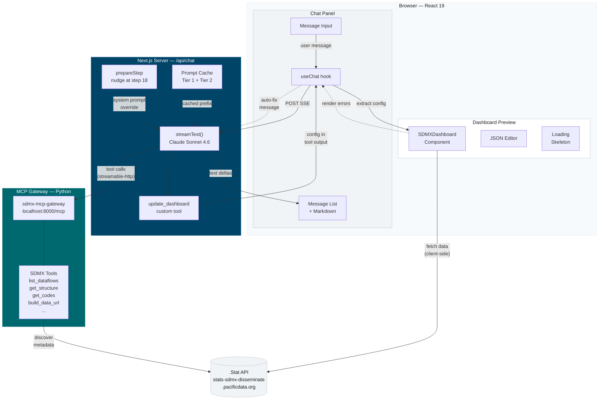

# SPC Conversational Dashboard Builder

A web app where users describe dashboards in natural language and an AI agent produces live SDMX data visualizations for Pacific Island Countries and Territories.

Built on three existing components:
- **sdmx-mcp-gateway** — Python MCP server for progressive SDMX data discovery
- **sdmx-dashboard-components** — React library rendering dashboards from JSON configs via Highcharts
- **AI SDK v6** — connects a chat interface to Claude, which orchestrates discovery and produces dashboard configs

## Prerequisites

| Tool | Version | Purpose |
|------|---------|---------|
| Node.js | >= 22 | Next.js runtime |
| npm | >= 11 | Package management |
| Python | >= 3.12 | MCP gateway runtime |
| uv | latest | Python package manager (for the gateway) |
| Git | any | Cloning repositories |

You also need an **Anthropic API key** with access to Claude Sonnet 4.6.

## Quick Start

```bash
# 1. Clone and start the MCP gateway
git clone https://github.com/Baffelan/sdmx-mcp-gateway.git
cd sdmx-mcp-gateway
uv sync
uv run python main_server.py --transport streamable-http --host 0.0.0.0 --port 8000

# 2. In another terminal — install and start the dashboard builder
cd dashboarder
cp .env.example .env.local
# Edit .env.local with your ANTHROPIC_API_KEY
npm install
npm run dev

# 3. Open http://localhost:3000/builder
```

## Repository Layout

```
dashboarder/
├── app/
│   ├── layout.tsx                  # Root layout (CSS imports)
│   ├── globals.css                 # Tailwind v4 + Oceanic design tokens
│   ├── page.tsx                    # Redirect to /builder
│   ├── builder/
│   │   └── page.tsx                # Main split-pane view (chat + preview)
│   └── api/
│       └── chat/
│           └── route.ts            # Agent loop: streamText + MCP + tools
├── components/
│   ├── chat-panel.tsx              # Chat UI (message list, input, suggestions)
│   ├── message-bubble.tsx          # Message rendering with markdown + tables
│   └── dashboard-preview.tsx       # Preview, JSON editor, inspector, export
├── lib/
│   ├── system-prompt.ts            # AI system prompt (strategy + schema + examples)
│   ├── dashboard-examples.ts       # Working example configs for few-shot prompting
│   ├── types.ts                    # Dashboard config TypeScript types
│   ├── export-dashboard.ts         # PDF, HTML, JSON export
│   ├── session.ts                  # localStorage session persistence
│   ├── use-config-history.ts       # Undo/redo hook
│   ├── tier2-knowledge.ts          # Session knowledge extraction for context
│   └── logger.ts                   # Server-side JSONL request logging
├── patches/
│   └── sdmx-dashboard-components+0.4.5.patch
├── logs/                           # Server-side chat logs (gitignored)
├── docs/
│   ├── architecture.mmd            # Mermaid source for architecture diagram
│   └── technical-reference.md      # Detailed technical documentation
├── stitch_assets/                  # UI mockups and design system spec
├── CLAUDE.md                       # Instructions for Claude Code
├── .env.example                    # Environment template
├── .env.local                      # API keys (gitignored)
├── next.config.ts
├── tsconfig.json
├── postcss.config.mjs
└── package.json
```

## Architecture



### Data flow

1. User types a message in the chat panel
2. `useChat` POSTs to `/api/chat` via SSE with session ID header
3. `streamText` calls Claude Sonnet 4.6 with MCP tools + `update_dashboard`
4. Claude does progressive discovery via MCP (list dataflows -> get structure -> build URL)
5. Claude calls `update_dashboard` with the dashboard JSON config
6. Tool output flows back to the client via the SSE stream
7. Client extracts config from tool output in message parts
8. `SDMXDashboard` renders the config, fetching live data directly from .Stat
9. If rendering fails, the error is debounced and automatically sent back to the AI

## Features

### Conversational dashboard building
- Natural language requests produce live SDMX dashboards
- AI proposes structure for complex requests, builds panel-by-panel
- Multi-turn conversation to refine charts, add panels, change data

### Live preview with JSON editor
- Real-time dashboard rendering via SDMXDashboard component
- Syntax-highlighted JSON editor with inline editing and apply/reset
- Loading skeleton matching the dashboard grid layout

### Session persistence
- Conversation and dashboard config saved to localStorage
- Survives page refresh; auto-saves with 1.5s debounce
- "New Session" button to start fresh; up to 20 sessions stored

### Undo/redo
- Every dashboard update (AI or manual) pushes to a 50-entry history stack
- Undo/redo buttons in the preview header
- History persisted across refreshes

### Export
| Format | File | Offline | Interactive |
|--------|------|---------|-------------|
| PDF | `.pdf` | Yes | No |
| HTML (static) | `.html` | Yes | No |
| HTML (live) | `-live.html` | No | Yes |
| JSON Config | `.json` | Yes | N/A |

### Error feedback loop
- Highcharts errors intercepted (no crashes)
- Fetch failures caught via `unhandledrejection`
- Errors debounced, deduplicated, and auto-sent to AI as system messages
- AI attempts to fix the dashboard config and re-emit

### Tier 2 knowledge context
- Conversation history scanned for already-discovered dataflows and URLs
- Compact summary injected into system prompt each turn
- Prevents redundant MCP discovery calls, saving tokens and steps

### Request logging
- Every chat request logged to `logs/chat-YYYY-MM-DD.jsonl`
- Captures: session ID, user message, AI response, tool calls, configs, errors, token usage, duration

## Development

```bash
npm run dev       # Start dev server (Turbopack)
npm run build     # Production build (Webpack)
npm run lint      # ESLint
```

### Environment variables

```bash
ANTHROPIC_API_KEY=sk-ant-...   # Required
MCP_GATEWAY_URL=http://localhost:8000/mcp  # Default
```

## Design System

The UI implements the **Oceanic Data-Scapes** design system (`stitch_assets/stitch/oceanic_logic/DESIGN.md`):

- **No 1px borders** — regions separated via tonal surface shifts
- **Surface hierarchy:** base `#f7fafc` -> low `#f1f4f6` -> card `#ffffff` -> high `#e5e9eb`
- **Primary palette:** Deep Sea `#004467`, Reef Teal `#006970`, Lagoon `#6fd6df`
- **Typography:** Manrope (headlines) + Inter (interface/data)
- **Glassmorphism:** 85% opacity + 20px backdrop-blur for app bar
- **Ambient shadows:** `0 12px 40px rgba(24,28,30,0.06)`
- **Ocean gradient:** 135deg `#004467` -> `#005c8a` for primary CTAs

## Troubleshooting

### MCP gateway won't start
Ensure Python >= 3.12 and uv are installed. Run `uv sync` before starting.

### "Error while fetching data please provide valid api url"
The data URL is malformed or returned no data. The error is auto-sent to the AI for fixing.

### Dashboard shows "Loading..." forever
Check the browser Network tab — SDMX REST requests to `stats-sdmx-disseminate.pacificdata.org` may be failing (CORS or network).

### Hydration mismatch after code changes
```bash
rm -rf .next && npm run dev
```

## Technical Reference

See [`docs/technical-reference.md`](docs/technical-reference.md) for detailed architecture documentation, module descriptions, and design decisions.

## License

See `dashboard-architecture.md` for project context and phased delivery plan.
